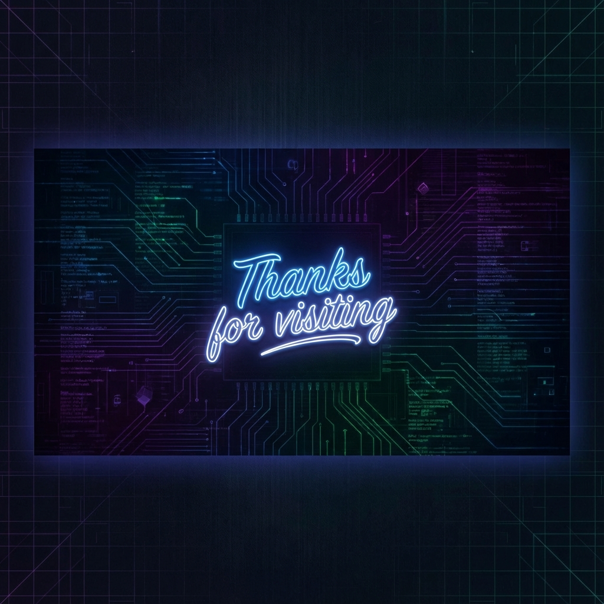

  

  <h2>👋 Hi, I'm Priyanshu Dey</h2>
  
<b>Python Developer | Telegram Bot Developer | Open Source Contributor</b>

  
  

    I'm a passionate developer currently working on <b>HyperLinkX</b> and diving deep into <b>Pyroblack, Telethon, and PTB</b>.
     
    Always looking to collaborate on interesting <b>Telegram Bots</b> and <b>APIs</b>.
  

  

 

  <h2>📊 GitHub Stats</h2>
  
   
  
   
  

 

  <h2>🛠️ Tech Stack</h2>
  
  <h3>Languages</h3>
  
  
  <h3>Frameworks & Libraries</h3>
  
  
  <h3>Databases & Cloud</h3>
  
  
  <h3>Tools</h3>
  

 

  <h2>🤝 Connect With Me</h2>
  
  

 

  

  

